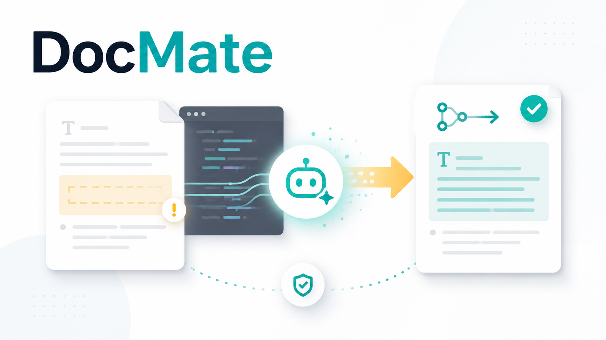
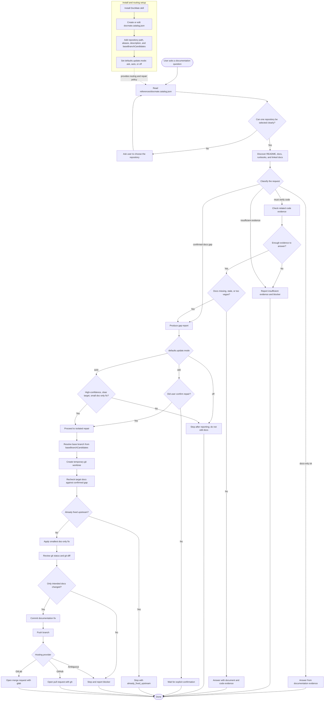

# DocMate

<p align="center">
  
</p>

DocMate is a skill-first documentation QA and documentation repair assistant for
agent platforms. It helps an agent answer from project documentation, verify gaps
against code, and optionally repair documentation by opening a GitHub pull
request or GitLab merge request.

## Workflow



## What It Does

- Installs as a skill for OpenClaw, Claude Code, OpenCode, Codex, and Hermes.
- Uses `~/.agents/skills/docmate` as the canonical install for Global and
  Custom installs; Codex reads that canonical skill directory directly.
- Uses an agent-readable `docmate.catalog.json` as a repository catalog.
- Routes to a configured repository path, then lets the agent discover
  documentation and related code evidence during the task.
- Reports documentation gaps with document evidence, code evidence, affected
  docs, and confidence.
- Supports `ask`, `auto`, and `off` modes for documentation repair.
- Uses temporary git worktrees so documentation repair does not dirty the user's
  main checkout.
- Opens GitHub PRs with `gh` and GitLab MRs with `glab`.
- Includes repository-agnostic golden eval cases under `evals/` for docs-only
  answers, stale docs, missing docs, defaults, and metrics labels.

## Quick Start

One-line install:

```bash
curl -fsSL https://raw.githubusercontent.com/wufei-png/DocMate/main/scripts/install.sh | bash
```

Interactive installs use keyboard menus when a TTY is available: Up/Down moves,
Space selects, and Enter selects or confirms depending on the menu.

The installer supports English and Chinese skill templates. Interactive installs
ask for the skill language. Non-interactive installs default to English for
backward compatibility; use `--language zh` for Chinese or `--language en` for
English explicitly.

Non-interactive install with explicit repositories:

```bash
bash scripts/install.sh --yes --repo /absolute/path/to/docs-repo
```

Chinese non-interactive install:

```bash
bash scripts/install.sh --yes --language zh --repo /absolute/path/to/docs-repo
```

Non-interactive install with repository auto scan:

```bash
bash scripts/install.sh --yes --auto-scan --scan-root /absolute/path/to/repo-prefix --scan-depth 2
```

Auto scan defaults to depth `2`. In interactive installs, the installer asks for
the scan depth after the prefix directory; for scripts, use `--scan-depth N` or
`DOCMATE_SCAN_MAX_DEPTH=N`.

Agent platform modes:

- `global` (default): install once to `~/.agents/skills/docmate` and enable all
  detected agent platforms: OpenClaw, Claude Code, OpenCode, Codex, and Hermes.
- `single`: install directly to one agent platform, for example
  `--install-mode single --hosts openclaw`.
- `custom`: install once to `~/.agents/skills/docmate` and enable the agent
  platforms selected by `--hosts`, for example `--hosts openclaw,codex`.
- `--hosts all` remains supported for script compatibility and selects every
  supported agent platform.

Then edit:

```text
~/.agents/skills/docmate/references/docmate.catalog.json
```

For `single` installs, use the `Catalog:` path printed by the installer instead.

Add repository aliases, descriptions, and base branch candidates as needed.
Descriptions and aliases are optional catalog fields. Add them when project
background or short names would help agents route vague requests.
The installer seeds `baseBranchCandidates` from each repository's detected
remote default branch with `gh`, `glab`, or `git`, then falls back to local HEAD
and finally `main`; edit it only when the repair base should differ.
The global repair behavior lives in `defaults.update.mode` and defaults to
`ask`.

## Validation

```bash
bash scripts/validate_catalog.sh ~/.agents/skills/docmate/references/docmate.catalog.json
python3 -m pytest -q
```

## License

MIT. See [LICENSE](LICENSE).
